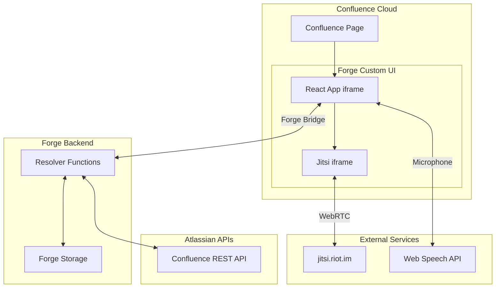
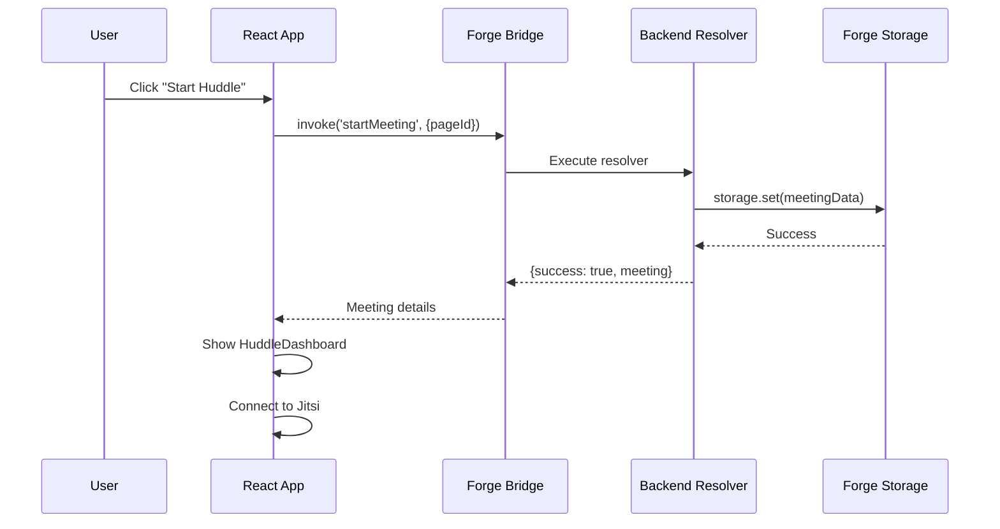
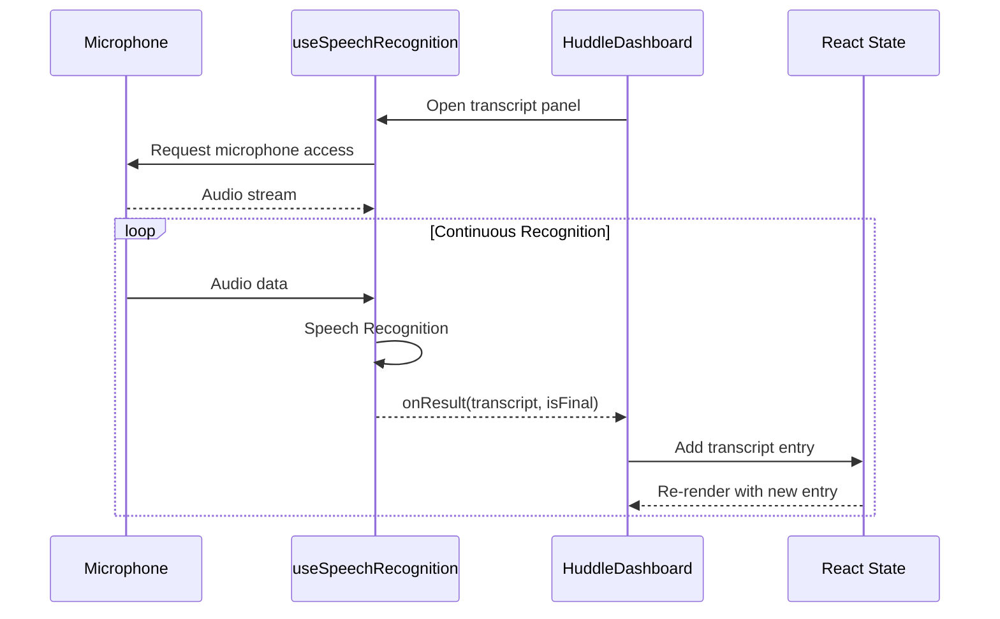

# Architecture Documentation

This document describes the technical architecture of the Huddle app, including system components, data flow, and design decisions.

## Table of Contents

- [System Overview](#system-overview)
- [Architecture Diagram](#architecture-diagram)
- [Component Architecture](#component-architecture)
- [Data Flow](#data-flow)
- [Technology Stack](#technology-stack)
- [Key Design Decisions](#key-design-decisions)
- [Security Considerations](#security-considerations)

---

## System Overview

Huddle is an Atlassian Forge app that provides video conferencing capabilities within Confluence. It uses a **Custom UI** architecture where:

- **Frontend**: React app running in an iframe within Confluence
- **Backend**: Serverless Forge functions for data storage and API calls
- **Video**: Third-party Jitsi Meet embedded via iframe
- **Transcription**: Browser-native Web Speech API

```
┌─────────────────────────────────────────────────────────────────┐
│                     Confluence Page                             │
│  ┌───────────────────────────────────────────────────────────┐  │
│  │                    Huddle Macro (iframe)                  │  │
│  │  ┌─────────────────┐  ┌─────────────────────────────────┐ │  │
│  │  │  Jitsi Video    │  │  React App                      │ │  │
│  │  │  (nested iframe)│  │  - Controls                     │ │  │
│  │  │                 │  │  - Transcript                   │ │  │
│  │  │                 │  │  - Chat                         │ │  │
│  │  └─────────────────┘  └─────────────────────────────────┘ │  │
│  └───────────────────────────────────────────────────────────┘  │
└─────────────────────────────────────────────────────────────────┘
         │                              │
         │ Forge Bridge                 │ Web Speech API
         ▼                              ▼
┌─────────────────┐            ┌─────────────────┐
│  Forge Backend  │            │  Browser Mic    │
│  - Storage      │            │  (Transcription)│
│  - Resolvers    │            └─────────────────┘
└─────────────────┘
         │
         ▼
┌─────────────────┐
│  Confluence     │
│  REST API       │
└─────────────────┘
```

---

## Architecture Diagram



---

## Component Architecture

### Frontend Components

```
frontend/src/
├── App.tsx                 # Root component with routing
├── pages/
│   ├── Index.tsx           # Main page - meeting state management
│   └── NotFound.tsx        # 404 page
├── components/
│   ├── HuddleDashboard.tsx # Active meeting UI
│   ├── HuddleInvitation.tsx# Start/Join screen
│   └── ui/                 # Reusable UI components
└── hooks/
    └── useSpeechRecognition.ts # Speech-to-text hook
```

#### Component Hierarchy

```
App
└── Index (pages/Index.tsx)
    ├── HuddleInvitation    # When no active meeting
    │   └── Start/Join buttons
    ├── HuddleDashboard     # During active meeting
    │   ├── Jitsi iframe
    │   ├── Control buttons
    │   ├── Transcript panel
    │   └── Chat panel
    └── HuddleSummary       # After meeting ends
```

### Backend Resolvers

```javascript
// src/index.js

resolver.define('startMeeting', async (req) => {
  // 1. Generate room name from page ID
  // 2. Save meeting to Forge Storage
  // 3. Return meeting details
});

resolver.define('stopMeeting', async (req) => {
  // 1. Delete meeting from Forge Storage
  // 2. Return success
});

resolver.define('getMeetingStatus', async (req) => {
  // 1. Check Forge Storage for active meeting
  // 2. Return meeting status
});
```

---

## Data Flow

### Starting a Meeting



### Live Transcription Flow



---

## Technology Stack

### Frontend

| Technology | Version | Purpose |
|------------|---------|---------|
| React | 18.x | UI framework |
| TypeScript | 5.x | Type safety |
| Vite | 5.x | Build tool |
| Tailwind CSS | 3.x | Styling |
| Framer Motion | - | Animations |
| Lucide React | - | Icons |
| @forge/bridge | - | Forge communication |

### Backend

| Technology | Purpose |
|------------|---------|
| Forge Functions | Serverless resolvers |
| Forge Storage | Persistent key-value storage |
| @forge/api | Atlassian API access |

### External Services

| Service | Purpose |
|---------|---------|
| jitsi.riot.im | Video conferencing (WebRTC) |
| Web Speech API | Browser speech recognition |

---

## Key Design Decisions

### 1. Jitsi via iframe (not External API)

**Decision**: Embed Jitsi using an iframe instead of the External API.

**Reason**: Forge's Content Security Policy (CSP) blocks external script loading. The External API requires loading `external_api.js` which is blocked.

**Trade-off**: Cannot programmatically control Jitsi (mute/unmute). Users must use Jitsi's built-in controls.

### 2. jitsi.riot.im over meet.jit.si

**Decision**: Use Matrix's Jitsi server instead of the main Jitsi server.

**Reason**: `meet.jit.si` enforces a lobby/prejoin page that cannot be disabled via URL parameters. `jitsi.riot.im` allows direct join.

### 3. Separate Transcription Stream

**Decision**: Use browser's Web Speech API independently from Jitsi audio.

**Reason**: 
- Cannot access Jitsi's audio stream due to iframe isolation
- No Jitsi External API access for events
- Browser Speech API provides reliable, built-in transcription

**Trade-off**: Transcription runs independently of Jitsi mute state. Manual toggle provided.

### 4. Forge Storage for Meeting State

**Decision**: Store active meeting state in Forge Storage keyed by page ID.

**Reason**:
- Simple key-value storage built into Forge
- Persists across function invocations
- Scoped to the app installation

### 5. Custom UI over UI Kit

**Decision**: Use Forge Custom UI instead of UI Kit.

**Reason**:
- Full React control for complex UI
- Better styling with Tailwind CSS
- iframe embedding support for Jitsi

---

## Security Considerations

### Content Security Policy

The app respects Forge's CSP with explicit permissions:

```yaml
permissions:
  external:
    frames:
      - 'https://jitsi.riot.im'    # Only allow this Jitsi server
    fetch:
      client:
        - 'https://jitsi.riot.im'
```

### Data Privacy

- **Meeting State**: Stored in Forge Storage (scoped to app)
- **Transcription**: Processed locally in browser, not sent to servers
- **Video/Audio**: Routed through Jitsi's WebRTC (end-to-end when enabled)

### Permissions Model

| Scope | Purpose |
|-------|---------|
| `storage:app` | Store meeting state |
| `read:confluence-content.all` | Get page context |
| `write:confluence-content` | Add meeting summaries |

---

## File Reference

| File | Lines | Purpose |
|------|-------|---------|
| `manifest.yml` | ~35 | App configuration and permissions |
| `src/index.js` | ~100 | Backend resolver functions |
| `frontend/src/pages/Index.tsx` | ~200 | Main state management |
| `frontend/src/components/HuddleDashboard.tsx` | ~320 | Meeting interface |
| `frontend/src/components/HuddleInvitation.tsx` | ~70 | Start/Join screen |
| `frontend/src/hooks/useSpeechRecognition.ts` | ~140 | Speech recognition hook |

---

## Future Considerations

1. **Rovo AI Integration**: Pass transcript to Rovo for AI-powered meeting summaries
2. **Self-hosted Jitsi**: Would enable External API for full control
3. **Multi-user Transcription**: Identify speakers (requires Jitsi API)
4. **Recording**: Store meeting recordings (requires Jitsi JWT auth)
